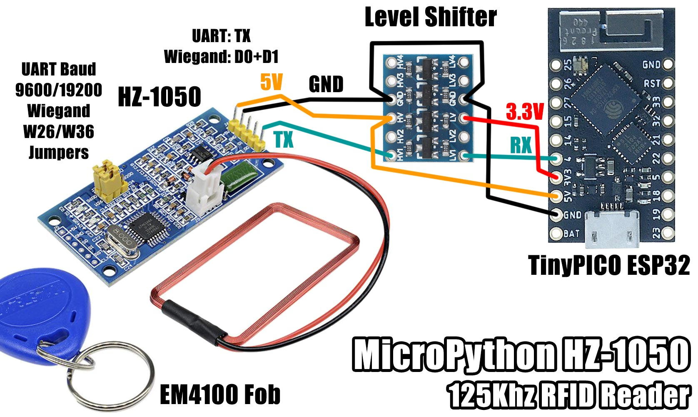
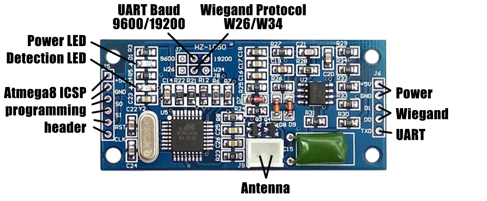

# MicroPython HZ-1050 125 KHz RFID Reader

A MicroPython library for the HZ-1050 RFID reader.




## Pins

Unless you are planning on reprogramming the Atmega8 brains of this module, you can ignore the 6 pin header on the left.

This module outputs on both UART (TXD) and Wiegand (D0,D1) pins. On detection, UART first, then ~600ms later Wiegand.

To use the UART interface, all you need to connect is 5V, GND, TXD on the right side.

To use the Wiegand interface, connect to 5V, GND, D0, D1.




## UART

The serial data consists of 4 bytes with no preamble, postamble or parity bits.

My example blue EM4100 keyfob is engraved with code 0003069055, which in hex is 0x002ED47F.

When detected, a UART read returns b'\x00.\xd4\x7f', which equates to b'\x00\x2E\xD4\x7F' and matches the keyfob in hex.

The 4 bytes (32 bits) match what you receive via Wiegand W34 when you strip the leading and trailing parity bits.

The first 2 bytes are whats known as the facility code, and the last 2 bytes are the card number.

Wiegand W26 differs to W34 in that it only has a 1 byte facility code.

```python
from machine import UART
uart1 = UART(1, baudrate=9600, tx=14, rx=4)

# callback to run on detection
def cb(code, facility, card):
	print('Code: {}, Facility: {}, Card: {}'.format(code, facility, card))

# poll the uart
def uart_demo(callback):
	buf = bytearray(4)
	while True:
		if uart1.any():
			uart1.readinto(buf)
			code = (buf[0] << 24) | (buf[1] << 16) | (buf[2] << 8) | buf[3]
			facility = code >> 16
			card = code & 0xFFFF
			callback(code, facility, card)

# run the demo
uart_demo(cb)

# scan my blue EM4100 tag with engraving "0003069055"
Code: 3069055, Facility: 46, Card: 54399

# scan my pink EM4100 tag with engraving "0008123291"
Code: 8123291, Facility: 123, Card: 62363

# scan my yellow EM4100 tag with engraving "0012459289"
Code: 12459289, Facility: 190, Card: 7449
```


## Wiegand

The two Wiegand data pins D0 and D1 are held HIGH until a card is detected.

On detection, the 24 or 32 bit card number (based on W26/W34 jumper) is transmit with a leading and trailing parity bit.

The leading parity bit is an even parity of the first 12 bits and the trailing parity is an odd parity bit of the last 12 bits

A logic 0 is when D0 goes LOW and D1 stays HIGH.

A logic 1 is when D1 goes LOW and D0 stays HIGH.

Data is sent MSB first.


## Features

* UART baud rate 9600 or 19200
* Wiegand selection 26 or 34 bit
* Read only support for EM4100, 4001 etc
* Frequency 125KHz
* Read time <0.2s
* Read distance 3-10cm
* Delay between reads 800ms
* Operating voltage 3.3 - 5.5V

I tried running this board on 3.3V but it failed to detect any cards at all.

I had to power the board with 5V and use a level shifter to convert the 5V TXD down to 3V3.


## Parts

* [TinyPICO](https://www.tinypico.com/) $20.00 USD
* [HZ-1050](https://www.aliexpress.com/item/32925644547.html) $3.39 AUD
* [Level shifter](https://www.aliexpress.com/item/1972789887.html) $2.15 AUD
* [10x EM4100 125KHz read only tags](https://www.aliexpress.com/item/32434392248.html) $2.52 AUD


## Connections

### TinyPICO ESP32

```python
from machine import UART
uart1 = UART(1, baudrate=9600, tx=14, rx=4)
```

This is a read only module, so only using the RX pin on the UART.

HZ-1050 | Level Shifter | TinyPICO (ESP32)
------- | ------------- | ----------------
VCC     | HV            | 5V
GND     | GND           | GND
\-      | LV            | 3V3
TXD     | H0            | \-
\-      | L0            | 4 (RX)


## Links

* [micropython.org](http://micropython.org)
* [TinyPICO Getting Started](https://www.tinypico.com/gettingstarted)
* [RFID on wikipedia](https://en.wikipedia.org/wiki/Radio-frequency_identification)
* [Wiegand on wikipedia](https://en.wikipedia.org/wiki/Wiegand_interface)
* [EM4100 Protocol](http://www.priority1design.com.au/em4100_protocol.html)

## License

Licensed under the [MIT License](http://opensource.org/licenses/MIT).

Copyright (c) 2020 Mike Causer
